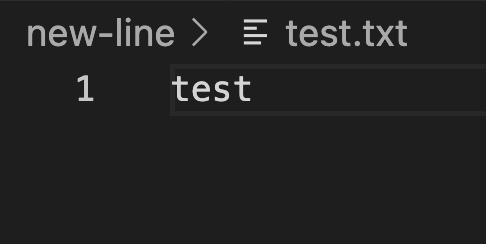
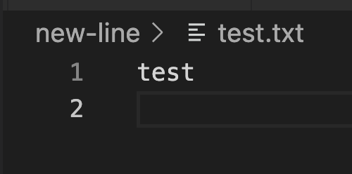

# 改行の確認

## 改行なし


``` sh
hexdump test.txt
0000000 74 65 73 74                                    
0000004
```

## 改行あり


``` sh
hexdump test.txt
0000000 74 65 73 74 0a                                 
0000005
```

macのVSCodeおよびvimではLineFeed(`0x0a`)のみが入ってた

windowsに合わせてCarriageReturn(`0x0d`)も入れてみる

``` sh
vim test.txt
# :%!xxd
# EDIT
# :%!xxd -r
```

その時の見た目（変わりなし）


